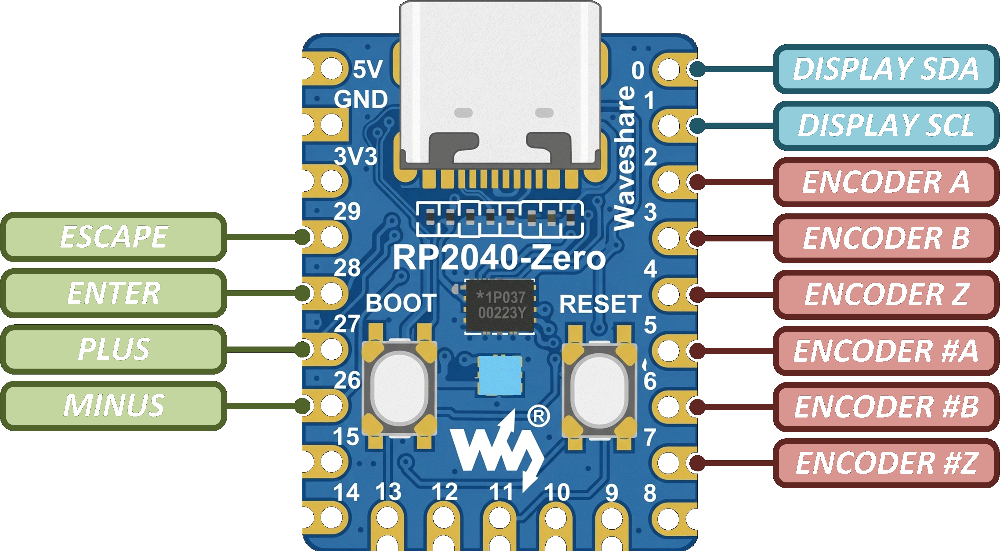

# Encoder Sniffer

A firmware for the [Waveshare RP2040-Zero](https://www.waveshare.com/rp2040-zero.htm) that reads two quadrature encoders simultaneously and displays live diagnostics on an SSD1306 OLED display.

Useful for identifying unknown encoders: connect the encoder, spin the shaft, and read off the PPR, direction, and error counts.

## Features

- Reads two quadrature (ABZ) encoder inputs in parallel — one normal, one with inverted wiring
- Automatically measures **pulses per revolution (PPR)** from the index (Z) pulse
- Detects and counts **missed AB pulses** (illegal 2-step transitions) and **missed Z pulses**
- Detects open / not-connected (N/C) inverted input
- **WS2812 RGB LED** status indicator: green = OK, blue = waiting for first Z pulse, red = error
- **SSD1306 128×64 OLED** display updated at 10 Hz via I2C
- USB CDC serial enabled (no UART)

## Hardware



Encoder inputs are driven by push-pull outputs — no pull-ups are needed on the RP2040 side. Button commons are connected to 3.3V (active-high), so internal pull-downs are used. The OLED is driven at 400 kHz I2C (address `0x3C`).

The second encoder input (GPIO 5–7) accepts inverted wiring — swap A/B or invert the signal — allowing you to test both polarities at once without rewiring.

## Display layout

```
POS:<position>
INV:<inverted position>  (or "INV: N/C" if no signal detected)
PPR:<ppr>    Z:<index count>
MISS:<ab miss>  MZ:<z miss>
<status line>
```

The status line shows `OK`, `Waiting for Z...`, `ERR: MISSED PULSES`, or `ERR: MISSED Z PULSE`.

## Building

Prerequisites: [Raspberry Pi Pico SDK](https://github.com/raspberrypi/pico-sdk) v2.2.0, CMake ≥ 3.20, and the ARM toolchain. The [VS Code Pico extension](https://marketplace.visualstudio.com/items?itemName=raspberry-pi.raspberry-pi-pico) sets these up automatically.

The u8g2 display library is fetched automatically by CMake at configure time.

```bash
mkdir build && cd build
cmake ..
make -j4
```

Flash `encoder-sniffer.uf2` to the board by holding BOOT while connecting USB, then copying the file to the mass-storage drive that appears.

## License

GPL-3.0-or-later — see [https://www.gnu.org/licenses/](https://www.gnu.org/licenses/).
